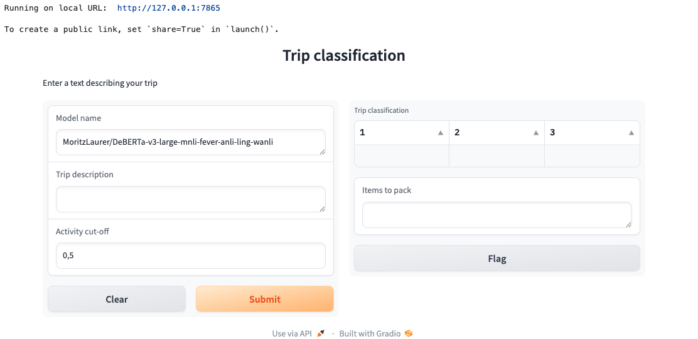

# Working with Large Language Models
## Introduction: Nikky
* What are LLMs and why are they popular
* How to use the open source platform to use LLMs for own application; example of creating a packing list.

## Why bother to adapt models to your application: Nikky
* Problems of LLMS: Hallucination and wrong outputs
* Controll outputs by using zero-shot-calssification
  * briefly mention other types of classification
* How we do it with our packing list model
  * Why not use packing items as classes
  * Use superclasses to categories trip and have packing items correspond to superclasses
  * Asses performance with small test data set
  * mention gradio app to make it user friendly and spaces to share model

## Implementation of packing list model
### Set up: Anja
**Hugging face account**

Hugging Face is a company and platform for the machine learning community to collaborate on models, datasets and applications, especially in the field of natural language processing.
To be able to use the full functionality offered by Hugging Face (e.g. acces to models, spaces, datasets, API access) you can create a free account [on their website](https://huggingface.co/).
(There is a new course at data camp, which is free for the remainder of 2025: https://huggingface.co/blog/huggingface/datacamp-ai-courses)

**Anaconda navigator**
To program our model, we use the anaconda navigator with package and environment manager conda, as well as Jupyter Notebook to write our python code. You can download the Anaconda navigator [here](https://www.anaconda.com/products/navigator). (python is automatically installed) 

Using the command line, you can create a new environment to work in and install the required packages. The following commands create a new environment called hf_env and activate it ([conda cheat sheet](https://docs.conda.io/projects/conda/en/4.6.0/_downloads/52a95608c49671267e40c689e0bc00ca/conda-cheatsheet.pdf)):

```bash
conda create --name hf_env
conda activate hf_env
```

Next, install the libraries used in this project and set up Jupyter Notebook.
```bash
pip install transformers torch numpy tabulate gradio pandas scikit-learn
conda install jupyter
jupyter-notebook
```
Create a new Jupyter Notebook for this project. 

### Hugging face API
Let's first try some Hugging Face models using their API. The advantage of using API is that you do not need to download the models locally and the computation is handled on Hugging Face servers.
To use their API you need to first create an access token. 
Log in to your Hugging Face account and go to  Settings > Access Tokens > + Create new token. Select as token type *Read* and give your token a name. 
This access token now has to be saved in you project folder in an .env file. Create a plain text file that you call .env. Within it you write and save:
```text
HF_API_TOKEN=YOUR_OWN_ACCESS_TOKEN
```
where you replace YOUR_OWN_ACCESS_TOKEN with your own access token. 

Now it's time to start coding and try a first zero-shot-classification model! In your Jupyter Notebook use a code cell to write the following python code:

```python
from dotenv import load_dotenv
import os
import requests
import json

load_dotenv()  # Load environment variables from .env file
headers = {"Authorization": f"Bearer {os.getenv('HF_API_TOKEN')}"}

candidate_labels = ["technology", "sports", "politics", "health"]

def query(model, input_text):
    API_URL = f"https://router.huggingface.co/hf-inference/models/{model}"
    payload = {
        "inputs": input_text,
        "parameters": {"candidate_labels": candidate_labels}
    }
    response = requests.post(API_URL, headers=headers, json=payload)
    return response.json()

```

In it we first load necessary libraries and then the .env file. We then create some candidate labels for our zero-shot-classification model and write a query function which receives a model name and an input text that needs to be classified and returns its classification. Trying the query function with the model "facebook/bart-large-mnli" from Hugging Face and a short input text we get the following: 

```python
input_text = "I just bought a new laptop, and it works amazing!"
output = query("facebook/bart-large-mnli", input_text)
print(json.dumps(output, indent=4))
```

```json
{
    "sequence": "I just bought a new laptop, and it works amazing!",
    "labels": [
        "technology",
        "health",
        "sports",
        "politics"
    ],
    "scores": [
        0.970917284488678,
        0.014999152161180973,
        0.008272469975054264,
        0.005811101291328669
    ]
}
```
The scores contain a probability of the text belonging to a particular label.

This worked great! However, using API the functionality is limited. We were limited to 10 candidate labels for our model. This was not sufficient for our packing list model.


### Predefine outputs/classes: Nikky

### Model implementation: Anja

Now we try to load the model locally and work with some more functionality. We load some libraries and also our clsss labels for our packing list model wich we saved in a json file and print out for your appreciation. We created several *superclasses* which each contain a list of possible class labels for our trip and will use a different zero-shot-classification model for each superclass.

```python
import math
import json
import pickle
import os
import time
import pandas as pd
import matplotlib.pyplot as plt
from tabulate import tabulate
from transformers import pipeline

# Get candidate labels
with open("packing_label_structure.json", "r") as file:
    candidate_labels = json.load(file)
keys_list = list(candidate_labels.keys())

for key in candidate_labels:
    print("\n", key, ":")
    for item in candidate_labels[key]:
        print("\t", item)
```

```text
activity_type :
	 hut trek (summer)
	 hut trek (winter)
	 camping trip (wild camping)
	 camping trip (campground)
	 ski tour / skitour
	 snowboard / splitboard trip
	 long-distance hike / thru-hike
	 digital nomad trip
	 city trip
	 road trip (car/camper)
	 festival trip
	 yoga / wellness retreat
	 micro-adventure / weekend trip
	 beach vacation
	 cultural exploration
	 nature escape

activities :
	 swimming
	 going to the beach
	 relaxing
	 sightseeing
	 biking
	 running
	 skiing
	 cross-country skiing
	 ski touring
	 hiking
	 hut-to-hut hiking
	 rock climbing
	 ice climbing
	 snowshoe hiking
	 kayaking / canoeing
	 stand-up paddleboarding (SUP)
	 snorkeling
	 scuba diving
	 surfing
	 paragliding
	 horseback riding
	 photography
	 fishing
	 rafting
	 yoga

climate_or_season :
	 cold destination / winter
	 warm destination / summer
	 variable weather / spring / autumn
	 tropical / humid
	 dry / desert-like
	 rainy climate

style_or_comfort :
	 ultralight
	 lightweight (but comfortable)
	 luxury (including evening wear)
	 minimalist

dress_code :
	 casual
	 formal (business trip)
	 conservative

accommodation :
	 indoor
	 huts with half board
	 sleeping in a tent
	 sleeping in a car

transportation :
	 own vehicle
	 no own vehicle

special_conditions :
	 off-grid / no electricity
	 self-supported (bring your own cooking gear)
	 travel with children
	 pet-friendly
	 snow and ice
	 high alpine terrain
	 snow, ice and avalanche-prone terrain
	 no special conditions to consider

trip_length_days :
	 1 day
	 2 days
	 3 days
	 4 days
	 5 days
	 6 days
	 7 days
	 7+ days
```

Use the pipeline function to load the model from Hugging Face and give the classifier function the trip description together with the candidate labels, in this case for the superclass *activity_type*.

```python
key = keys_list[0]
model_name = "facebook/bart-large-mnli"
trip_descr = "I am planning a trip to Greece with my boyfriend, where we will visit two islands. We have booked an apartment on each island for a few days and plan to spend most of our time relaxing. Our main goals are to enjoy the beach, try delicious local food, and possibly go on a hike—if it’s not too hot. We will be relying solely on public transport. We’re in our late 20s and traveling from the Netherlands."
classifier = pipeline("zero-shot-classification", model = model_name)
result = classifier(trip_descr, candidate_labels[keys_list[0]])

df = pd.DataFrame({
    "Label": result["labels"],
    "Score": result["scores"]
})
print(df)
```

```text
                             Label     Score
0                   beach vacation  0.376311
1   micro-adventure / weekend trip  0.350168
2                    nature escape  0.133974
3               digital nomad trip  0.031636
4             cultural exploration  0.031271
5          yoga / wellness retreat  0.012846
6                    festival trip  0.012700
7   long-distance hike / thru-hike  0.009527
8                hut trek (summer)  0.008148
9                        city trip  0.007793
10          road trip (car/camper)  0.006512
11              ski tour / skitour  0.005670
12       camping trip (campground)  0.004448
13     snowboard / splitboard trip  0.004113
14     camping trip (wild camping)  0.002714
15               hut trek (winter)  0.002170
```

The most likely activity type our model predicted is beach vacation, which is correct! Now we will do this for every superclass and we choose the most likely label to be the label for our trip, except for the *activities* superclass. Since it is possible and likely to do more than one activity during your travels within the classifier function we set the multi_label option to True. This means that the text can belong to more than one class and each label is evaluated independently and a probability of belonging to that class (vs not belonging to that class) is returned. The activities that we choose as our best guess are those with a probability of more than 50 percent (cut_off = 0.5).

```python
cut_off = 0.5
result_activ = classifier(trip_descr, candidate_labels["activities"], multi_label=True)
indices = [i for i, score in enumerate(result_activ['scores']) if score > cut_off]
classes = [result_activ['labels'][i] for i in indices]

df = pd.DataFrame({
    "Label": result["labels"],
    "Score": result["scores"]
})
print(df)
print(classes)
```

```text
                            Label     Score
0              going to the beach  0.991486
1                        relaxing  0.977136
2                          hiking  0.942628
3                        swimming  0.219020
4                     sightseeing  0.175862
5                         running  0.098545
6               hut-to-hut hiking  0.083704
7                          biking  0.036792
8                     photography  0.036690
9                         surfing  0.030993
10  stand-up paddleboarding (SUP)  0.025300
11                     snorkeling  0.021451
12                           yoga  0.011070
13            kayaking / canoeing  0.007511
14                  rock climbing  0.006307
15                        fishing  0.003497
16                    paragliding  0.002656
17                        rafting  0.001970
18               horseback riding  0.001560
19                snowshoe hiking  0.001528
20           cross-country skiing  0.001502
21                   ice climbing  0.001434
22                         skiing  0.001169
23                   scuba diving  0.000789
24                    ski touring  0.000491
['going to the beach', 'relaxing', 'hiking']
```

Now we write a function that does all the predictions for each superclass automatically for a tripdescription.

```python
# doing this for all superclasses, depending on local machine this might take a while
def pred_trip(model_name, trip_descr, cut_off = 0.5):
    """
    Classifies trip
    
    Parameters:
    model_name: name of hugging-face model
    trip_descr: text describing the trip
    cut_off: cut_off for choosing activities

    Returns:
    pd Dataframe: with class predictions and true values
    """
    
    classifier = pipeline("zero-shot-classification", model=model_name)
    df = pd.DataFrame(columns=['superclass', 'pred_class'])
    for i, key in enumerate(keys_list):
        print(f"\rProcessing {i + 1}/{len(keys_list)}", end="", flush=True)
        if key == 'activities':
            result = classifier(trip_descr, candidate_labels[key], multi_label=True)
            indices = [i for i, score in enumerate(result['scores']) if score > cut_off]
            classes = [result['labels'][i] for i in indices]
        else:
            result = classifier(trip_descr, candidate_labels[key])
            classes = result["labels"][0]
        df.loc[i] = [key, classes]
    return df

result = pred_trip(model_name, trip_descr, cut_off = 0.5)
print(result)
```

```text
           superclass                              pred_class
0       activity_type                          beach vacation
1          activities  [going to the beach, relaxing, hiking]
2   climate_or_season               warm destination / summer
3    style_or_comfort                              minimalist
4          dress_code                                  casual
5       accommodation                    huts with half board
6      transportation                          no own vehicle
7  special_conditions               off-grid / no electricity
8    trip_length_days                                 7+ days
```

And there we have the predicted labels for our trip description.

### Using gradio app: Anja
Now, let's use the Gradio library to wrap our classification function in an interactive interface with inputs and outputs.

```python
# Prerequisites
import gradio as gr

# get candidate labels
with open("packing_label_structure.json", "r") as file:
    candidate_labels = json.load(file)
keys_list = list(candidate_labels.keys())

```

```python
emo = gr.Interface(
    fn=pred_trip,
    inputs=[
        gr.Textbox(label="Model name", value = "MoritzLaurer/DeBERTa-v3-large-mnli-fever-anli-ling-wanli"),
        gr.Textbox(label="Trip description"),
        gr.Number(label="Activity cut-off", value = 0.5),
    ],
    # outputs="dataframe",
    outputs=[gr.Dataframe(label="DataFrame")],
    title="Trip classification",
    description="Enter a text describing your trip",
)

# Launch the Gradio app
if __name__ == "__main__":
    demo.launch()

```




### Share your model: Anja
**Hugging Face Spaces**
A straightforward way to share the model with other people is to use Hugging Face Spaces, where you can create a free Space which you can potentially expand on later. Go to https://huggingface.co/spaces and click on "+ New Space", as SDK choose Gradio and as template Blank, as Space hardware choose "CPU Basic", and click on "Create Space" to create your Space.
Connected to your space is a remote git repository which is a smooth way to push your model code to the Space. Once the Sapce is created you will see the url of your Space and some instructions of how to set it up.

```bash
# When prompted for a password, use an access token with write permissions.
# Generate one from your settings: https://huggingface.co/settings/tokens
git clone https://huggingface.co/spaces/<username>/<space_name>
```

In the command line navigate to your project folder, initialize git and connect the remote.

```bash
cd path/to/your/project
git init
git remote add origin https://huggingface.co/spaces/<username>/<space-name>
```

To push to your remote first generate another access token for your Space. On the Hugging Face website click on your icon, select Access Tokens, then + Create new token. As token type select Write, give your token a name and click on Create Token. 

The Space will automatically run the model code from a app.py file. In your project folder create the file app.py (e.g. on mac in command line: touch app.py) and open it. We need to copy all relevant code for our gradio app in it:

```python
# Prerequisites
from transformers import pipeline
import json
import pandas as pd
import gradio as gr

# Get candidate labels
with open("packing_label_structure.json", "r") as file:
    candidate_labels = json.load(file)
keys_list = list(candidate_labels.keys())

def pred_trip(model_name, trip_descr, cut_off = 0.5):
    """
    Classifies trip
    
    Parameters:
    model_name: name of hugging-face model
    trip_descr: text describing the trip
    cut_off: cut_off for choosing activities

    Returns:
    pd Dataframe: with class predictions and true values
    """
    
    classifier = pipeline("zero-shot-classification", model=model_name)
    df = pd.DataFrame(columns=['superclass', 'pred_class'])
    for i, key in enumerate(keys_list):
        print(f"\rProcessing {i + 1}/{len(keys_list)}", end="", flush=True)
        if key == 'activities':
            result = classifier(trip_descr, candidate_labels[key], multi_label=True)
            indices = [i for i, score in enumerate(result['scores']) if score > cut_off]
            classes = [result['labels'][i] for i in indices]
        else:
            result = classifier(trip_descr, candidate_labels[key])
            classes = result["labels"][0]
        df.loc[i] = [key, classes]
    return df

demo = gr.Interface(
    fn=pred_trip,
    inputs=[
        gr.Textbox(label="Model name", value = "MoritzLaurer/DeBERTa-v3-large-mnli-fever-anli-ling-wanli"),
        gr.Textbox(label="Trip description"),
        gr.Number(label="Activity cut-off", value = 0.5),
    ],
    # outputs="dataframe",
    outputs=[gr.Dataframe(label="DataFrame")],
    title="Trip classification",
    description="Enter a text describing your trip",
)

# Launch the Gradio app
if __name__ == "__main__":
    demo.launch()
```

Additionally we need to create a plain text requirements file called requirements.txt, which tells Hugging Face which Python dependencies to install before running your app. Write and save the following in your requirements.txt file:

```text
transformers
torch
numpy
pandas
gradio
```

After you add, commit and push these changes to your remote you can go to the url of your space and try it out!

```text
https://huggingface.co/spaces/<username>/<space-name>
```


## Performance assessment: Anja
To asses the performance of different zero-shot classification models we manually created a small test data set of 10 trip descriptions and correct classifications. We used 12 of the most popular zero-shot-classification Hugging Face Models to compare classification performance. Performance was assessed in terms of accuracy (percentage of correct classifications/total classifications) for all superclasses excluding for the activities class. More than one type of activity can be correct and we use the percentage of correctly identified activities (#correctly identified/#total correct activities) and the percentage of wrongly identified activities (#falsly predicted/#total predicted activities) to asses the performance of the activities classification.

Let's first have a look at three of our test data trip descriptions and true class labels:


```text
I am going on a multiple day hike and passing though mountains and the beach in Croatia. I like to pack light and will stay in refugios/huts with half board and travel to the start of the hike by car. It will be 6-7 days. 

long-distance hike / thru-hike
['going to the beach']
tropical / humid
minimalist
casual
huts with half board
own vehicle
off-grid / no electricity
6 days
```

Our predictions using e.g. model "" could now look like this

We computed averages of performance measures for each model sorted by accuracy and averaged over our 10 test data sets.

```text
                                                        model  accuracy  true_ident  false_pred
0    MoritzLaurer-DeBERTa-v3-large-mnli-fever-anli-ling-wanli  0.611111    0.841667    0.546667
1                       sileod-deberta-v3-base-tasksource-nli  0.566667    0.700000    0.551667
2                MoritzLaurer-DeBERTa-v3-base-mnli-fever-anli  0.522222    0.841667    0.572381
3                 MoritzLaurer-deberta-v3-large-zeroshot-v2.0  0.500000    0.325000    0.500000
4                               valhalla-distilbart-mnli-12-1  0.500000    0.300000    0.533333
5   MoritzLaurer-mDeBERTa-v3-base-xnli-multilingual-nli-2mil7  0.488889    0.833333    0.688373
6                          cross-encoder-nli-deberta-v3-large  0.466667    0.566667    0.541667
7                                    facebook-bart-large-mnli  0.466667    0.708333    0.400000
8                     MoritzLaurer-mDeBERTa-v3-base-mnli-xnli  0.455556    0.408333    0.481250
9                           cross-encoder-nli-deberta-v3-base  0.444444    0.533333    0.712500
10                      joeddav-bart-large-mnli-yahoo-answers  0.355556    0.650000    0.553792
11                                pongjin-roberta_with_kornli  0.233333    0.666667    0.452857
```


## Closing
* Summary
* Limitations
