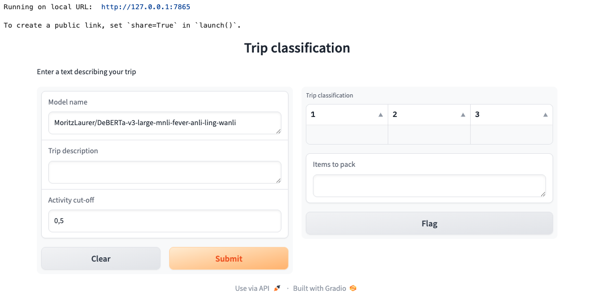

# Working with Large Language Models
## Introduction: Nikky

Nowadays many people regularly use AI chatbots. These chatbots “understand” text and talk with you like they are humans with an above average level of knowledge (…when they are not hallucinating or answering falsely ;-) ). Behind such bots and systems is usually a Large Language Model (LLM). This is an AI-model trained on enormous amount of texts, so that it can recognize the meaning and logic of language.

## Why bother to adapt models to your application: Nikky
### What are LLM’s used for in practice?

A cool characteristic of LLM’s, is that they can respond in a very logical and natural way. That is why they are currently used more and more to analyze text, but also to organize information and even to generate creative ideas. AI agents are now also gaining very much in popularity, these agents are using LLM’s and automatization to learn and automatize processes. Since we were interested in their potential on a real life application, we tested how we can use LLM’s in providing personalized packing lists to know what to take on your holiday, adventure travel and/or business trip.

## The application: Personalized Holiday packing lists

The goal of the project is to develop a framework using LLM’s that automatically generates packing lists based on a textual description of a trip. This description can be really short (“a weekend camping in the mountains”) or much more elaborate (“10 days tour through Iceland in summer with hikes, camping and remote workdays. I will also do strength training, yoga and sleep outside”). The model will for instance try to understand the type, destination and duration of the trip, the season, and potential extra activities or characteristics and will then provide a list of potentially necessary items to pack for each trip.

We tested several open source NLI en zero-shot models (such as BART and DeBERTa - more about them later) to see which one performs the best on several different indicators. We have found that the standard models and options are not always directly fittable to any situation, and that when you plan to ‘use an LLM in practice’ for your own application, you might need some extra steps to make the output more reliable, consistent and usable.

In this post, we hope to outline all the steps we took and share our search for the best approach and model. We will share the code we used and the considerations we had on the way, to provide you with the tools to start applying LLM’s for your own projects and applications.

### Different types of (open-source) LLM’s

So many different LLM’s exist, with each of them having strengths and weaknesses. Some well known models such as GPT, Claude, Gemeni, LlaMa and Mistral are used for text generation and chats/conversations. For applications such as our project, where a model should understand text and than provide a list based on categories that are taken from the provided description, classification and NLI models such as BART, DeBERTa and RoBERTa can be more suitable. These type of classification models are better in recognizing the meaning and then giving a fixed set of most probable categories as outputs.

### Output: Free text or classification?

When you use a normal text-generating LLM, there are many free parameters, and packing lists outcome can then become very chaotic and unstable over time. This is why a classification model can help in providing users with well structured packing lists with the necessary items for their trip. Of course, this choice highly depends on what you would like as a final output for your application. In case you want a conversation, the text generating models would be of better use. Since we really want to provide the user with a list of items based on categories derived from the trip description, using classification models as the base for the framework seemed to be more suitable for our application.

### Trainability of LLM’s

The existing LLM’s as mentioned in the above introduction can be either used “off-the-shelf” without modification, or you can provide them with extra information regarding your specific application. If you use an text-generating LLM, as a chatbot for your customer service, you can train the model by giving more information about your specific return policy, for instance. In case of the zero-shot models, you may specify categories specific to your application, so that you will always receive the estimates for that set of categories you’re interested in.

### Open-source platforms and models

Many powerful LLM’s are available on platforms such as  
- [Hugging Face](https://huggingface.co/)  
- [Replicate](https://replicate.com/)  
- [ModelScope](https://modelscope.cn/)  
- [OpenRouter](https://openrouter.ai/)

This makes it possible to use existing models, compare them before using on the platforms and adjust them to your own application without having to train a model from scratch.

For our project we have used models from Hugging Face with the  
- [Transformers library](https://pypi.org/project/transformers/) in Python to test and combine models, and  
- [Gradio](https://www.gradio.dev/) to build a simple user interface around it.  

This means we can experiment with input and output in a visual interface, and observe the output of our models directly in an app.

## Implementation of packing list model
### Set up: Anja

To use the full functionality offered by Hugging Face (e.g. access to models, spaces, datasets, API access) you can create a free account on their website https://huggingface.co/.

To develop our model, we use the Anaconda Navigator, which includes the package and environment manager conda, as well as Jupyter Notebook for writing and running Python code. You can download the Anaconda navigator from their website https://www.anaconda.com/products/navigator. (Python is installed automatically) 

After installation you can use the command line to create a new environment to work in and install the required packages. The following commands create a new environment called hf_env and activate it:

```bash
conda create --name hf_env
conda activate hf_env
```

Next, install the libraries used in this project and set up Jupyter Notebook.

```bash
pip install transformers torch numpy tabulate gradio pandas scikit-learn
conda install jupyter
jupyter-notebook
```
Create a new Jupyter Notebook for this project and you are ready to start coding. 


### Hugging face API
Let's first try out some Hugging Face models using their API. The main advantage of using the API is that you don't need to download the models locally - everything runs on Hugging Face’s servers.

To use the API, you'll first need to create an access token. Go to https://huggingface.co/settings/tokens and click *+ Create new token*. Choose *Read* as the token type and give it a name. 
Next, save this token in your project folder using a .env file. Create a plain text file called .env, then add the following line (replacing YOUR_OWN_ACCESS_TOKEN with your actual access token) and save it:

```text
HF_API_TOKEN=YOUR_OWN_ACCESS_TOKEN
``` 

Now it's time to start coding and try out your first zero-shot-classification model. In your Jupyter Notebook, create a code cell and enter the following Python code:

```python
from dotenv import load_dotenv
import os
import requests
import json

load_dotenv()  
headers = {"Authorization": f"Bearer {os.getenv('HF_API_TOKEN')}"}

candidate_labels = ["technology", "sports", "politics", "health"]

def query(model, input_text):
    API_URL = f"https://router.huggingface.co/hf-inference/models/{model}"
    payload = {
        "inputs": input_text,
        "parameters": {"candidate_labels": candidate_labels}
    }
    response = requests.post(API_URL, headers=headers, json=payload)
    return response.json()

```

In this code, we first load the required libraries and the .env file. Next, we then define a set of candidate labels for our zero-shot classification model. Finally, we implement a query function which takes a model name and an input text and returns the model's classification. 

Trying the query function with the Hugging Face model "facebook/bart-large-mnli" and a short input text we get the following result: 

```python
input_text = "I just started to play tennis, and it's so much fun!"
output = query("facebook/bart-large-mnli", input_text)
print(json.dumps(output, indent=4))
```

```json
[
    {
        "label": "sports",
        "score": 0.9877110719680786
    },
    {
        "label": "health",
        "score": 0.006601463537663221
    },
    {
        "label": "technology",
        "score": 0.004392746835947037
    },
    {
        "label": "politics",
        "score": 0.0012947289505973458
    }
]
```
The scores represent the probabilities of the text belonging to a particular class label.

This approach worked great! However, when using the API we ran into some limitations. 
in particular, we were limited to 10 candidate labels for classification, which wasn't enough for our packing list model.


### Predefine outputs/classes: Nikky

### Model implementation: Anja

Now we load the model locally and work with additional functionality. We import the required libraries and load our class labels from a JSON file. The last code block prints out these labels, grouped into several *superclasses*. For each superclass, we will use a dedicated zero-shot classification model that returns the most likely class label. This gives us a list of relevant labels for our trip, which we later map to specific packing item lists.

```python
import json
import pandas as pd
from tabulate import tabulate
from transformers import pipeline

with open("packing_label_structure.json", "r") as file:
    candidate_labels = json.load(file)
keys_list = list(candidate_labels.keys())

for key in candidate_labels:
    print("\n", key, ":")
    for item in candidate_labels[key]:
        print("\t", item)
```

```text
activity_type :
	 hut trek (summer)
	 hut trek (winter)
	 camping trip (wild camping)
	 camping trip (campground)
	 ski tour / skitour
	 snowboard / splitboard trip
	 long-distance hike / thru-hike
	 digital nomad trip
	 city trip
	 road trip (car/camper)
	 festival trip
	 yoga / wellness retreat
	 micro-adventure / weekend trip
	 beach vacation
	 cultural exploration
	 nature escape

activities :
	 swimming
	 going to the beach
	 relaxing
	 sightseeing
	 biking
	 running
	 skiing
	 cross-country skiing
	 ski touring
	 hiking
	 hut-to-hut hiking
	 rock climbing
	 ice climbing
	 snowshoe hiking
	 kayaking / canoeing
	 stand-up paddleboarding (SUP)
	 snorkeling
	 scuba diving
	 surfing
	 paragliding
	 horseback riding
	 photography
	 fishing
	 rafting
	 yoga

climate_or_season :
	 cold destination / winter
	 warm destination / summer
	 variable weather / spring / autumn
	 tropical / humid
	 dry / desert-like
	 rainy climate

style_or_comfort :
	 ultralight
	 lightweight (but comfortable)
	 luxury (including evening wear)
	 minimalist

dress_code :
	 casual
	 formal (business trip)
	 conservative

accommodation :
	 indoor
	 huts with half board
	 sleeping in a tent
	 sleeping in a car

transportation :
	 own vehicle
	 no own vehicle

special_conditions :
	 off-grid / no electricity
	 self-supported (bring your own cooking gear)
	 travel with children
	 pet-friendly
	 snow and ice
	 high alpine terrain
	 snow, ice and avalanche-prone terrain
	 no special conditions to consider

trip_length_days :
	 1 day
	 2 days
	 3 days
	 4 days
	 5 days
	 6 days
	 7 days
	 7+ days
```

Next, we use the pipeline function to load the model *facebook/bart-large-mnli* from Hugging Face. Then we pass the trip description together with the candidate labels for the *activity_type* superclass, to the classifier and print the results as a pandas DataFrame.

```python
model_name = "facebook/bart-large-mnli"
trip_descr = "I am planning a trip to Greece with my boyfriend, where we will visit two islands. We have booked an apartment on each island for a few days and plan to spend most of our time relaxing. Our main goals are to enjoy the beach, try delicious local food, and possibly go on a hike—if it’s not too hot. We will be relying solely on public transport. We’re in our late 20s and traveling from the Netherlands."
classifier = pipeline("zero-shot-classification", model = model_name)
result = classifier(trip_descr, candidate_labels["activity_type"])

df = pd.DataFrame({
    "Label": result["labels"],
    "Score": result["scores"]
})
print(df)
```

```text
                             Label     Score
0                   beach vacation  0.376311
1   micro-adventure / weekend trip  0.350168
2                    nature escape  0.133974
3               digital nomad trip  0.031636
4             cultural exploration  0.031271
5          yoga / wellness retreat  0.012846
6                    festival trip  0.012700
7   long-distance hike / thru-hike  0.009527
8                hut trek (summer)  0.008148
9                        city trip  0.007793
10          road trip (car/camper)  0.006512
11              ski tour / skitour  0.005670
12       camping trip (campground)  0.004448
13     snowboard / splitboard trip  0.004113
14     camping trip (wild camping)  0.002714
15               hut trek (winter)  0.002170
```

The model predicts "beach vacation" as most likely, which is correct! We then repeat this process for each superclass and pick the most likely class label for our trip, with one exception: the *activities* superclass. Because a trip can include more than one activity, we enable the multi_label option in the classifier function. This allows the text to be assigned to more than one class. Each label is evaluated independently, and the model returns a probability for whether the text belongs to that class or not. We treat any activity with a probability above 50% as a good match and include it in our final selection.

```python
cut_off = 0.5
result_activ = classifier(trip_descr, candidate_labels["activities"], multi_label=True)
classes = df.loc[df["Score"] > 0.5, "Label"].tolist()

df = pd.DataFrame({
    "Label": result_activ["labels"],
    "Score": result_activ["scores"]
})
print(df)
print(classes)
```

```text
                            Label     Score
0              going to the beach  0.991486
1                        relaxing  0.977136
2                          hiking  0.942628
3                        swimming  0.219020
4                     sightseeing  0.175862
5                         running  0.098545
6               hut-to-hut hiking  0.083704
7                          biking  0.036792
8                     photography  0.036690
9                         surfing  0.030993
10  stand-up paddleboarding (SUP)  0.025300
11                     snorkeling  0.021451
12                           yoga  0.011070
13            kayaking / canoeing  0.007511
14                  rock climbing  0.006307
15                        fishing  0.003497
16                    paragliding  0.002656
17                        rafting  0.001970
18               horseback riding  0.001560
19                snowshoe hiking  0.001528
20           cross-country skiing  0.001502
21                   ice climbing  0.001434
22                         skiing  0.001169
23                   scuba diving  0.000789
24                    ski touring  0.000491
['going to the beach', 'relaxing', 'hiking']
```

Next, we write a function that automatically runs the predictions for each superclass based on a given trip description and try it out.

```python
def pred_trip(model_name, trip_descr, cut_off = 0.5):
    """
    Classifies trip
    
    Parameters:
    model_name: name of hugging-face model
    trip_descr: text describing the trip
    cut_off: cut_off for choosing activities

    Returns:
    pd Dataframe: with class predictions
    """
    
    classifier = pipeline("zero-shot-classification", model=model_name)
    df = pd.DataFrame(columns=['superclass', 'pred_class'])
    for i, key in enumerate(keys_list):
        print(f"\rProcessing {i + 1}/{len(keys_list)}", end="", flush=True)
        if key == 'activities':
            result = classifier(trip_descr, candidate_labels[key], multi_label=True)
            indices = [i for i, score in enumerate(result['scores']) if score > cut_off]
            classes = [result['labels'][i] for i in indices]
        else:
            result = classifier(trip_descr, candidate_labels[key])
            classes = result["labels"][0]
        df.loc[i] = [key, classes]
    return df

result = pred_trip(model_name, trip_descr, cut_off = 0.5)
print(result)
```

```text
Processing 9/9           superclass                              pred_class
0       activity_type                          beach vacation
1          activities  [going to the beach, relaxing, hiking]
2   climate_or_season               warm destination / summer
3    style_or_comfort                              minimalist
4          dress_code                                  casual
5       accommodation                    huts with half board
6      transportation                          no own vehicle
7  special_conditions               off-grid / no electricity
8    trip_length_days                                 7+ days
```

And just like that, we get the predicted labels for our trip description. For each label, we’ve put together a matching list of items to pack. Next, we simply connect those trip labels to the packing items by loading a file with packing items and adding some code to our pred_trip function:

```python
# Load packing item data
with open("packing_templates_self_supported_offgrid_expanded.json", "r") as file:
    packing_items = json.load(file)


def pred_trip(model_name, trip_descr, cut_off = 0.5):
    """
    Classifies trip
    
    Parameters:
    model_name: name of hugging-face model
    trip_descr: text describing the trip
    cut_off: cut_off for choosing activities

    Returns:
    pd Dataframe: with class predictions
    """
    
    classifier = pipeline("zero-shot-classification", model=model_name)
    df = pd.DataFrame(columns=['superclass', 'pred_class'])
    for i, key in enumerate(keys_list):
        print(f"\rProcessing {i + 1}/{len(keys_list)}", end="", flush=True)
        if key == 'activities':
            result = classifier(trip_descr, candidate_labels[key], multi_label=True)
            indices = [i for i, score in enumerate(result['scores']) if score > cut_off]
            classes = [result['labels'][i] for i in indices]
        else:
            result = classifier(trip_descr, candidate_labels[key])
            classes = result["labels"][0]
        df.loc[i] = [key, classes]
    
    ## Look up and return list of items to pack based on class predictions
    # make list from dataframe column
    all_classes = [elem for x in df["pred_class"] for elem in (x if isinstance(x, list) else [x])]
    # look up packing items for each class/key
    list_of_list_of_items = [packing_items.get(k, []) for k in all_classes]
    # combine lists and remove doubble entries
    flat_unique = []
    for sublist in list_of_list_of_items:
        for item in sublist:
            if item not in flat_unique:
                flat_unique.append(item)
    # sort alphabetically and add newlines
    sorted_list = "\n".join(sorted(flat_unique))  
    return df, sorted_list

result = pred_trip(model_name, trip_descr, cut_off = 0.5)

print(result[0])
print(result[1])
```

```text
            superclass                              pred_class
0       activity_type                          beach vacation
1          activities  [going to the beach, relaxing, hiking]
2   climate_or_season               warm destination / summer
3    style_or_comfort                              minimalist
4          dress_code                                  casual
5       accommodation                    huts with half board
6      transportation                          no own vehicle
7  special_conditions               off-grid / no electricity
8    trip_length_days                                 7+ days
1 set of clothing for every situation
USB hub (for multiple devices)
all‑in‑one soap
backpack
backup lighting (e.g. small flashlight)
beach bag
beach chair
beach towel
blister plasters or tape
book or e‑reader
cap or hat
cash for payments
comfortable clothing
compact toothbrush
cooler
daypack
earplugs
emergency communication (e.g. GPS beacon or satellite messenger)
extra charger cables
extra clothing layer
first aid kit
flashlight or headlamp
flip flops
foldable solar panel (if on longer trips)
hat or cap
headlamp + extra batteries
hiking boots or trail runners
hiking poles
hiking socks (anti-blister)
jeans or comfortable pants
light pajamas or sleepwear
light shoes
light towel
lightweight clothing
lightweight towel
music / headphones
navigation (map/compass/GPS)
navigation device with offline maps
notebook + pen
number of meals/snacks matched to duration
packaging to keep electronics dry
paper map and compass
power bank (at least 10,000 mAh)
public transport app or ticket
rain jacket or poncho
rechargeable batteries and charger
reservation confirmation
seat cushion or beach mat
sheet liner (often required)
slippers or indoor shoes for inside
small backpack
small toiletry bag
snacks / energy bars
snacks for along the way
sneakers
socks per day
solar panel or portable charging system
sun hat
sunglasses
sunscreen
sunscreen and sunglasses
sweater or hoodie
swimwear
t-shirts
toiletry bag
underwear per day
water bottle
water bottle(s) or hydration bladder
```
We are ready! But let's make it a bit more user friendly in the next step!

### Gradio App: Anja
Gradio makes it easy to wrap machine learning functions into an interactive interface with inputs and outputs. All we need to do is pass our function pred_trip, along with the input and output formats and some default values into the gr.Interface function. 

```python
import gradio as gr

demo = gr.Interface(
    fn=pred_trip,
    inputs=[
        gr.Textbox(label="Model name", value = "MoritzLaurer/DeBERTa-v3-large-mnli-fever-anli-ling-wanli"),
        gr.Textbox(label="Trip description"),
        gr.Number(label="Activity cut-off", value = 0.5),
    ],
    outputs=[gr.Dataframe(label="Trip classification"), gr.Textbox(label="Items to pack")],
    title="Trip classification",
    description="Enter a text describing your trip",
)

# Launch the Gradio app
if __name__ == "__main__":
    demo.launch()

```




And that's it. The app is now ready to take your trip description and return a packing list for your trip! 


### Share your model: Anja
**Hugging Face Spaces**
A simple way to share your model with others is to use Hugging Face Spaces, where you can create a free Space that can be expanded later. Head to https://huggingface.co/spaces and click on "+ New Space". Choose 
* SDK: Gradio
* Template: Blank
* Space hardware CPU Basic
Then click on "Create Space".
Connected to your space is a remote git repository which makes is easy to push your model code to the Space. Once your Space is created you'll see its URL along with instructions on how to set it up.

```bash
# When prompted for a password, use an access token with write permissions.
# Generate one from your settings: https://huggingface.co/settings/tokens
git clone https://huggingface.co/spaces/<username>/<space_name>
```
As prompted, go to https://huggingface.co/settings/tokens to generate an access token. Click on *+ Create new token*, set the token type to *Write*. Give your token a name and click on *Create Token*. You'll use this token as a password to push to your remote repository. 

Next, open the command line, navigate to where you want your project folder and clone the remote repository:

```bash
cd path/to/where/you/want/the-folder
git clone https://huggingface.co/spaces/<username>/<space-name>
```
Put your project files into the newly created folder named <space-name>.

The Space automatically runs whatever model code you put in a file called app.py. In your project folder, create that file (e.g. on mac in command line: touch app.py) and open it. Copy all relevant code for your Gradio app into this file and save it.

```python
import json
import pandas as pd
from transformers import pipeline
import gradio as gr

# get candidate labels
with open("packing_label_structure.json", "r") as file:
    candidate_labels = json.load(file)
keys_list = list(candidate_labels.keys())

# Load packing item data
with open("packing_templates_self_supported_offgrid_expanded.json", "r") as file:
    packing_items = json.load(file)


def pred_trip(model_name, trip_descr, cut_off = 0.5):
    """
    Classifies trip
    
    Parameters:
    model_name: name of hugging-face model
    trip_descr: text describing the trip
    cut_off: cut_off for choosing activities

    Returns:
    pd Dataframe: with class predictions
    """
    
    classifier = pipeline("zero-shot-classification", model=model_name)
    df = pd.DataFrame(columns=['superclass', 'pred_class'])
    for i, key in enumerate(keys_list):
        print(f"\rProcessing {i + 1}/{len(keys_list)}", end="", flush=True)
        if key == 'activities':
            result = classifier(trip_descr, candidate_labels[key], multi_label=True)
            indices = [i for i, score in enumerate(result['scores']) if score > cut_off]
            classes = [result['labels'][i] for i in indices]
        else:
            result = classifier(trip_descr, candidate_labels[key])
            classes = result["labels"][0]
        df.loc[i] = [key, classes]
    
    ## Look up and return list of items to pack based on class predictions
    # make list from dataframe column
    all_classes = [elem for x in df["pred_class"] for elem in (x if isinstance(x, list) else [x])]
    # look up packing items for each class/key
    list_of_list_of_items = [packing_items.get(k, []) for k in all_classes]
    # combine lists and remove doubble entries
    flat_unique = []
    for sublist in list_of_list_of_items:
        for item in sublist:
            if item not in flat_unique:
                flat_unique.append(item)
    # sort alphabetically and add newlines
    sorted_list = "\n".join(sorted(flat_unique))  
    return df, sorted_list


demo = gr.Interface(
    fn=pred_trip,
    inputs=[
        gr.Textbox(label="Model name", value = "MoritzLaurer/DeBERTa-v3-large-mnli-fever-anli-ling-wanli"),
        gr.Textbox(label="Trip description"),
        gr.Number(label="Activity cut-off", value = 0.5),
    ],
    outputs=[gr.Dataframe(label="Trip classification"), gr.Textbox(label="Items to pack")],
    title="Trip classification",
    description="Enter a text describing your trip",
)

# Launch the Gradio app
if __name__ == "__main__":
    demo.launch()

```

Additionally, in your project folder, create a plain text file named requirements.txt.
This file tells Hugging Face which Python dependencies to install before running your app.
Add the following lines to your requirements.txt file and save it:

```text
transformers
torch
numpy
pandas
gradio
```

After that, navigate to your project folder, add, commit, and push your changes to the remote repository.

```bash
cd <space-name>
git add .
git commit -m "initial commit"
git push origin master
```

Once the push is complete, go to the URL of your Space and try it out!

```text
https://huggingface.co/spaces/<username>/<space-name>
```


## Performance assessment: Anja
To see how well different zero-shot classification models perform, we put together a small test data set of 10 trip descriptions with corresponding class labels. We then compared 12 of the most popular zero-shot classification Models available on Hugging Face. 

We assessed performance using accuracy (#correct classifications/#total classifications) across all superclasses, excluding the activities superclass. Since a single trip can include multiple activities, we measured the percentage of correctly identified activities (#correctly identified/#total correct activities) and the percentage of wrongly predicted activities (#falsly predicted/#total predicted activities).

We then calculated the average performance metrics across the test dataset for each model and ranked them based on their accuracy.

```text
                                                        model  accuracy  true_ident  false_pred
0    MoritzLaurer-DeBERTa-v3-large-mnli-fever-anli-ling-wanli  0.611111    0.841667    0.546667
1                       sileod-deberta-v3-base-tasksource-nli  0.566667    0.700000    0.551667
2                MoritzLaurer-DeBERTa-v3-base-mnli-fever-anli  0.522222    0.841667    0.572381
3                 MoritzLaurer-deberta-v3-large-zeroshot-v2.0  0.500000    0.325000    0.500000
4                               valhalla-distilbart-mnli-12-1  0.500000    0.300000    0.533333
5   MoritzLaurer-mDeBERTa-v3-base-xnli-multilingual-nli-2mil7  0.488889    0.833333    0.688373
6                          cross-encoder-nli-deberta-v3-large  0.466667    0.566667    0.541667
7                                    facebook-bart-large-mnli  0.466667    0.708333    0.400000
8                     MoritzLaurer-mDeBERTa-v3-base-mnli-xnli  0.455556    0.408333    0.481250
9                           cross-encoder-nli-deberta-v3-base  0.444444    0.533333    0.712500
10                      joeddav-bart-large-mnli-yahoo-answers  0.355556    0.650000    0.553792
11                                pongjin-roberta_with_kornli  0.233333    0.666667    0.452857
```


## Closing
* Summary
* Limitations
