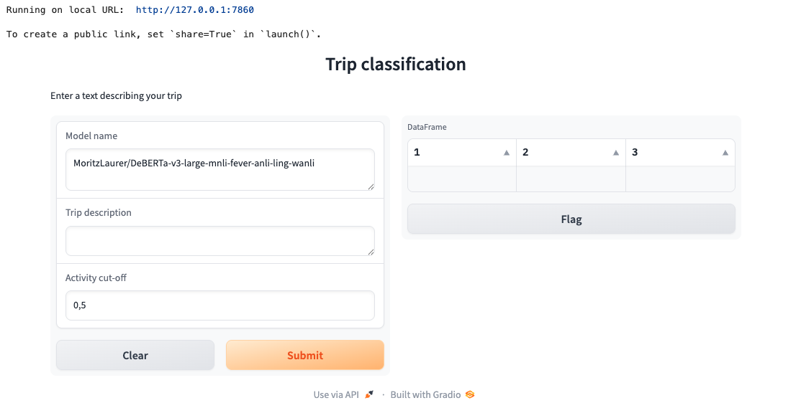

# Working with Large Language Models
## Introduction: Nikky
* What are LLMs and why are they popular
* How to use the open source platform to use LLMs for own application; example of creating a packing list.

## Why bother to adapt models to your application: Nikky
* Problems of LLMS: Hallucination and wrong outputs
* Controll outputs by using zero-shot-calssification
  * briefly mention other types of classification
* How we do it with our packing list model
  * Why not use packing items as classes
  * Use superclasses to categories trip and have packing items correspond to superclasses
  * Asses performance with small test data set
  * mention gradio app to make it user friendly and spaces to share model

## Implementation of packing list model
### Prerequisites before you start to code: Anja
**Hugging face account**

Hugging face is a company and platform for machine learning community to collaborate on models, datasets and applications especially in the field of natural language processing.
To be able to use the full funcitonality (e.g. acces to models, spaces, datasets, api access) and you need to make a hugging face account [here](https://huggingface.co/).

There is a new course at data camp, which is free for the remainder of 2025: https://huggingface.co/blog/huggingface/datacamp-ai-courses

**Anaconda navigator**
We will use anaconda navigator with thepackage and environment manager conda and use jupyter notebook to write our python code. You can download the Anaconda navigator [here](https://www.anaconda.com/products/navigator). (python is automatically installed) 

Using the command line you can create a new environment in which you will work and isntall the necessary packages. The following code creates a new environment that is called hf_env and activate it ([conda cheat sheet](https://docs.conda.io/projects/conda/en/4.6.0/_downloads/52a95608c49671267e40c689e0bc00ca/conda-cheatsheet.pdf)):

```bash
conda create --name hf_env
conda activate hf_env
```

Install necessary packages using pip
```bash
pip install transformers torch numpy tabulate gradio pandas scikit-learn
```

Install jupyter notebook and start it up
```bash
conda install jupyter
jupyter-notebook
```
Create a new jupyter notebook in which you write your code. 

### Hugging face API
Let us first try out some Hugging Face models using their API. The advantage of using API is that you do not need to download the model locally and the computation is handled on Hugging Face servers.
To use their API you need to first create an access token. 
Log in to your Hugging Face account and go to  Settings (on left side) > Access Tokens (on left side) > + Create new token. Select token type Read and give your token a name. 
This access token now has to be saved in you project folder in a .env file. Create a plain text file that you call .env. Within it you write and save:
```text
HF_API_TOKEN=YOUR_OWN_ACCESS_TOKEN
```

Now we load a zero-shot-classification model using API and make a simple classification.
```python
from dotenv import load_dotenv
import os
import requests

load_dotenv()  # Load environment variables from .env file, contains personal access token (HF_API_TOKEN=your_token)
headers = {"Authorization": f"Bearer {os.getenv('HF_API_TOKEN')}"}

candidate_labels = ["technology", "sports", "politics", "health"]

def query(model, input_text):
    API_URL = f"https://api-inference.huggingface.co/models/{model}"
    payload = {
        "inputs": input_text,
        "parameters": {"candidate_labels": candidate_labels}
    }
    response = requests.post(API_URL, headers=headers, json=payload)
    return response.json()

input_text = "I just bought a new laptop, and it works amazing!"

output = query("facebook/bart-large-mnli", input_text)
print(output)
```

```json
{'sequence': 'I just bought a new laptop, and it works amazing!', 'labels': ['technology', 'health', 'sports', 'politics'], 'scores': [0.970917284488678, 0.014999152161180973, 0.008272469975054264, 0.005811101291328669]}
```

However the functionality using API is limited and we were only allowed to use 10 candidate labels for our models. This was not sufficient for our packing list example.


### Predefine outputs/classes: Nikky

### Model implementation: Anja
Prerequisites
```python
import math
import json
import pickle
import os
import time
import pandas as pd
import matplotlib.pyplot as plt
from tabulate import tabulate
from transformers import pipeline

# Get candidate labels
with open("packing_label_structure.json", "r") as file:
    candidate_labels = json.load(file)
keys_list = list(candidate_labels.keys())

for key in candidate_labels:
    print("\n", key, ":")
    for item in candidate_labels[key]:
        print("\t", item)
```

```text
activity_type :
	 hut trek (summer)
	 hut trek (winter)
	 camping trip (wild camping)
	 camping trip (campground)
	 ski tour / skitour
	 snowboard / splitboard trip
	 long-distance hike / thru-hike
	 digital nomad trip
	 city trip
	 road trip (car/camper)
	 festival trip
	 yoga / wellness retreat
	 micro-adventure / weekend trip
	 beach vacation
	 cultural exploration
	 nature escape

activities :
	 swimming
	 going to the beach
	 relaxing
	 sightseeing
	 biking
	 running
	 skiing
	 cross-country skiing
	 ski touring
	 hiking
	 hut-to-hut hiking
	 rock climbing
	 ice climbing
	 snowshoe hiking
	 kayaking / canoeing
	 stand-up paddleboarding (SUP)
	 snorkeling
	 scuba diving
	 surfing
	 paragliding
	 horseback riding
	 photography
	 fishing
	 rafting
	 yoga

climate_or_season :
	 cold destination / winter
	 warm destination / summer
	 variable weather / spring / autumn
	 tropical / humid
	 dry / desert-like
	 rainy climate

style_or_comfort :
	 ultralight
	 lightweight (but comfortable)
	 luxury (including evening wear)
	 minimalist

dress_code :
	 casual
	 formal (business trip)
	 conservative

accommodation :
	 indoor
	 huts with half board
	 sleeping in a tent
	 sleeping in a car

transportation :
	 own vehicle
	 no own vehicle

special_conditions :
	 off-grid / no electricity
	 self-supported (bring your own cooking gear)
	 travel with children
	 pet-friendly
	 snow and ice
	 high alpine terrain
	 snow, ice and avalanche-prone terrain
	 no special conditions to consider

trip_length_days :
	 1 day
	 2 days
	 3 days
	 4 days
	 5 days
	 6 days
	 7 days
	 7+ days
```


We can use the pipeline function to load the model from hugging face locally and give the classifier function the trip description together with the candidate labels.

```python
key = keys_list[0]
model_name = "facebook/bart-large-mnli"
trip_descr = "I am planning a trip to Greece with my boyfriend, where we will visit two islands. We have booked an apartment on each island for a few days and plan to spend most of our time relaxing. Our main goals are to enjoy the beach, try delicious local food, and possibly go on a hike—if it’s not too hot. We will be relying solely on public transport. We’re in our late 20s and traveling from the Netherlands."
classifier = pipeline("zero-shot-classification", model = model_name)
result = classifier(trip_descr, candidate_labels[keys_list[0]])
# Create DataFrame
df = pd.DataFrame({
    "Label": result["labels"],
    "Score": result["scores"]
})
print(df)
```

```text
                             Label     Score
0                   beach vacation  0.376311
1   micro-adventure / weekend trip  0.350168
2                    nature escape  0.133974
3               digital nomad trip  0.031636
4             cultural exploration  0.031271
5          yoga / wellness retreat  0.012846
6                    festival trip  0.012700
7   long-distance hike / thru-hike  0.009527
8                hut trek (summer)  0.008148
9                        city trip  0.007793
10          road trip (car/camper)  0.006512
11              ski tour / skitour  0.005670
12       camping trip (campground)  0.004448
13     snowboard / splitboard trip  0.004113
14     camping trip (wild camping)  0.002714
15               hut trek (winter)  0.002170
```

Now we will do this for every superclass. We do something slightly different for the activities superclass since it is possible and likely to do more than one activity during your travels. Within the classifier function we set the multi_label option to True, which means that the text can belong to more than one class and each label is evaluated independently and a probability of belonging to that class is returned. We choose a 

```python
cut_off = 0.5
result_activ = classifier(trip_descr, candidate_labels["activities"], multi_label=True)
indices = [i for i, score in enumerate(result_activ['scores']) if score > cut_off]
classes = [result_activ['labels'][i] for i in indices]

df = pd.DataFrame({
    "Label": result["labels"],
    "Score": result["scores"]
})
print(df)
print(classes)
```

```text
                             Label     Score
0                   beach vacation  0.376311
1   micro-adventure / weekend trip  0.350168
2                    nature escape  0.133974
3               digital nomad trip  0.031636
4             cultural exploration  0.031271
5          yoga / wellness retreat  0.012846
6                    festival trip  0.012700
7   long-distance hike / thru-hike  0.009527
8                hut trek (summer)  0.008148
9                        city trip  0.007793
10          road trip (car/camper)  0.006512
11              ski tour / skitour  0.005670
12       camping trip (campground)  0.004448
13     snowboard / splitboard trip  0.004113
14     camping trip (wild camping)  0.002714
15               hut trek (winter)  0.002170

['going to the beach', 'relaxing', 'hiking']
```

To do this for all superclasses we use the following function

```python
# doing this for all superclasses, depending on local machine this might take a while
def pred_trip(model_name, trip_descr, cut_off = 0.5):
    """
    Classifies trip
    
    Parameters:
    model_name: name of hugging-face model
    trip_descr: text describing the trip
    cut_off: cut_off for choosing activities

    Returns:
    pd Dataframe: with class predictions and true values
    """
    
    classifier = pipeline("zero-shot-classification", model=model_name)
    df = pd.DataFrame(columns=['superclass', 'pred_class'])
    for i, key in enumerate(keys_list):
        print(f"\rProcessing {i + 1}/{len(keys_list)}", end="", flush=True)
        if key == 'activities':
            result = classifier(trip_descr, candidate_labels[key], multi_label=True)
            indices = [i for i, score in enumerate(result['scores']) if score > cut_off]
            classes = [result['labels'][i] for i in indices]
        else:
            result = classifier(trip_descr, candidate_labels[key])
            classes = result["labels"][0]
        df.loc[i] = [key, classes]
    return df

result = pred_trip(model_name, trip_descr, cut_off = 0.5)
print(result)
```

```text
Processing 9/9           superclass                              pred_class
0       activity_type                          beach vacation
1          activities  [going to the beach, relaxing, hiking]
2   climate_or_season               warm destination / summer
3    style_or_comfort                              minimalist
4          dress_code                                  casual
5       accommodation                    huts with half board
6      transportation                          no own vehicle
7  special_conditions               off-grid / no electricity
8    trip_length_days                                 7+ days
```

### Using gradio app: Anja
Now we want to make it more user friendly using hte gradio app. You can for now run the app in your jupyter notebook. 

```python
# Prerequisites
from transformers import pipeline
import json
import pandas as pd
import gradio as gr

# get candidate labels
with open("packing_label_structure.json", "r") as file:
    candidate_labels = json.load(file)
keys_list = list(candidate_labels.keys())

# Load packing item data
with open("packing_templates_self_supported_offgrid_expanded.json", "r") as file:
    packing_items = json.load(file)
```

```python
emo = gr.Interface(
    fn=pred_trip,
    inputs=[
        gr.Textbox(label="Model name", value = "MoritzLaurer/DeBERTa-v3-large-mnli-fever-anli-ling-wanli"),
        gr.Textbox(label="Trip description"),
        gr.Number(label="Activity cut-off", value = 0.5),
    ],
    # outputs="dataframe",
    outputs=[gr.Dataframe(label="DataFrame"), gr.Textbox(label="List of words")],
    title="Trip classification",
    description="Enter a text describing your trip",
)

# Launch the Gradio app
if __name__ == "__main__":
    demo.launch()

```




### Share your model: Anja
* created space
An easy way to share your modle is using hugging face spaces. Go to https://huggingface.co/spaces and click on "+ New Space", as SDK choose Gradio and as template Blank, as Space hardware you can choose "CPU Basic", and click on "Create Space" to create your space.
* space as remote repository
connected to your space is a remote git repository that you can push your code to. For this navigate to your project folder in the terminal

```bash
cd path/to/your/project
git init
```

And connect your hugging face space as a remote repository

```bash
git remote add origin https://huggingface.co/spaces/<username>/<space-name>
```

generate an access token for your space by clicking on your icon and then selecting Access Tokens > + Create new token and as token type select Write. Give your tokena. name and click on Creat Token. Store your token securely. Use it


* you need to install the required dependencies in the environment where your Hugging Face Space is running.
* create requirements.txt file with necessary libraries


## Performance assessment: Anja
* Test data creation


## Closing
* Summary
* Limitations
